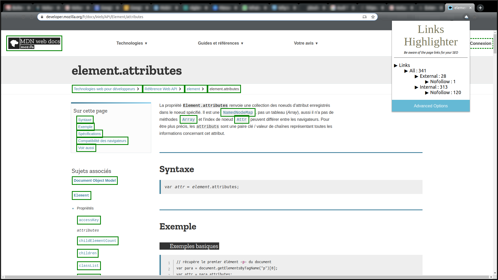

# link_highlighter_extention
Chrome extension to highlight SEO useful html links

## Description
This extension adds a border around "internal" and "external" links in the page.<br/>
It also make difference between nofollow and "do-follow" links. <br/>
It is useful to analyse SEO of sites.<br/>


## Setup
This extension is not published on Google Web Store.<br/>
To use it, go to ```chrome://extensions``` and either add source files with the "Load the unpackaged extension" button or drag and drop the .crx file from ```bin``` directory.

## Todo
* Create the options's page to modify CSS applied on links types
* Add individual activation switch for links types
* Add blinking activation option 

## Known bugs
* Make only the border blinking and not all the link html tag content

## Credit
Developed by Jordan Douliez
